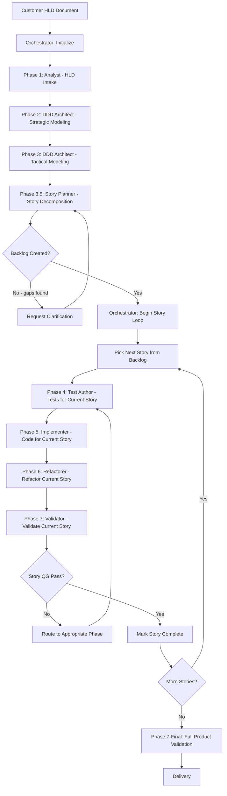
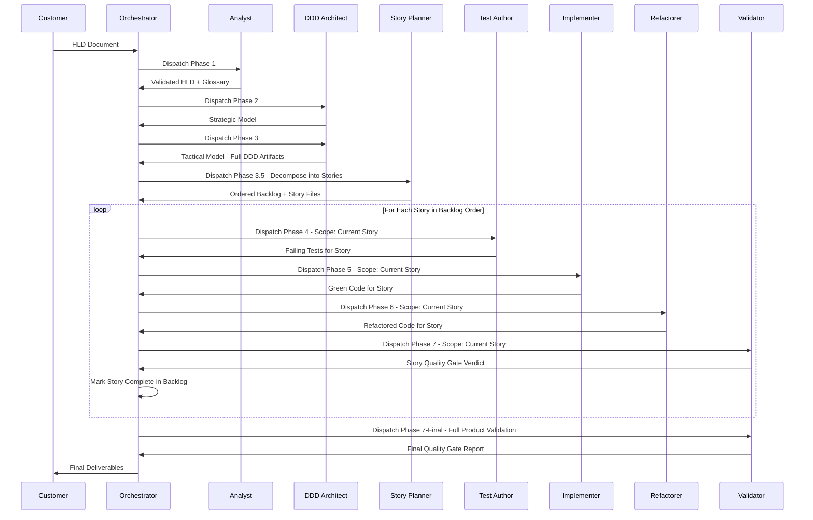

# Story Planner Skill — Complete Implementation Plan

> **Version**: 1.0.0
> **Date**: 2026-03-02
> **Status**: Draft — Awaiting Approval

---

## 1. Executive Summary

This plan introduces a new **Story Planner** skill into the TDD-DDD Framework. The skill sits between Phase 3 (Tactical Domain Modeling) and Phase 4 (Test Specification), creating a new **Phase 3.5: Story Decomposition**. It accepts the validated DDD architecture as input and decomposes it into an ordered backlog of MVP-scoped, implementation-ready user stories. Each story then drives a complete TDD red-green-refactor cycle through Phases 4–7, executed iteratively — one story at a time.

### Key Design Decisions

| Decision | Choice | Rationale |
|----------|--------|-----------|
| Pipeline placement | Post-Phase-3, Pre-Phase-4 (Phase 3.5) | Requires validated DDD model as input; stories scope subsequent TDD cycles |
| Story granularity | Implementation-ready | Each story maps to one or more aggregates/services within a single bounded context |
| Story ordering | Strict sequential | Story Planner determines optimal order upfront; order is fixed once backlog is created |
| Story storage | Individual JSON files under `docs/stories/` | Version-control friendly, machine-parseable, human-readable, traceable |
| Backlog index | Single `docs/stories/backlog.json` | Central manifest listing all stories in execution order with status tracking |
| Workflow change | Iterative outer loop around Phases 4–7 | Orchestrator executes Phases 4→5→6→7 for each story sequentially |

---

## 2. Revised Workflow Architecture

### 2.1 Original 7-Phase Pipeline

```
Phase 1 → Phase 2 → Phase 3 → Phase 4 → Phase 5 → Phase 6 → Phase 7
```

### 2.2 New Pipeline with Story Decomposition

```
Phase 1 → Phase 2 → Phase 3 → Phase 3.5 → [Phase 4 → Phase 5 → Phase 6 → Phase 7] × N stories
```

### 2.3 Workflow Diagram



### 2.4 Sequence Diagram



---

## 3. Story File Schema

### 3.1 Storage Location

Stories are stored under `docs/stories/` with the following structure:

```
docs/
└── stories/
    ├── backlog.json              # Central manifest with ordered story list and statuses
    ├── STORY-001-title.json      # Individual story files
    ├── STORY-002-title.json
    ├── STORY-003-title.json
    └── ...
```

### 3.2 Naming Convention

- **Backlog index**: `docs/stories/backlog.json`
- **Story files**: `STORY-NNN-kebab-case-title.json` (e.g., `STORY-001-create-order-aggregate.json`)
- NNN is zero-padded to 3 digits, sequential, starting at 001
- Title portion is kebab-case, derived from the story title, max 50 characters

### 3.3 Individual Story Schema

```json
{
  "$schema": "story-schema-v1",
  "storyId": "STORY-001",
  "sequenceNumber": 1,
  "title": "Create Order Aggregate with Line Items",
  "userStory": "As a [persona from HLD], I want [capability] so that [benefit]",
  "boundedContext": "OrderManagement",
  "aggregates": ["Order"],
  "dddArtifacts": [
    {
      "type": "aggregate",
      "name": "Order",
      "specPath": "docs/ddd/aggregates/order.md"
    },
    {
      "type": "value-object",
      "name": "Money",
      "specPath": "docs/ddd/value-objects/money.md"
    }
  ],
  "acceptanceCriteria": [
    {
      "id": "AC-001",
      "criterion": "Order can be created with at least one line item",
      "testable": true
    },
    {
      "id": "AC-002",
      "criterion": "Order total equals sum of all line item amounts",
      "testable": true
    }
  ],
  "traceability": {
    "hldRequirements": ["HLD-REQ-001", "HLD-REQ-003", "HLD-REQ-007"],
    "hldFeatureNarratives": ["HLD-FN-001"],
    "hldBusinessGoals": ["HLD-BG-001"]
  },
  "complexity": "M",
  "mvpJustification": "Core domain entity required by all downstream stories",
  "dependsOn": [],
  "status": "pending",
  "phaseProgress": {
    "phase4": "pending",
    "phase5": "pending",
    "phase6": "pending",
    "phase7": "pending"
  },
  "createdAt": "2026-03-02T12:00:00.000Z",
  "completedAt": null
}
```

### 3.4 Field Definitions

| Field | Type | Required | Description |
|-------|------|----------|-------------|
| `storyId` | string | Yes | Unique identifier: `STORY-NNN` |
| `sequenceNumber` | integer | Yes | Execution order position (1-based) |
| `title` | string | Yes | Concise descriptive title |
| `userStory` | string | Yes | Standard format: As a..., I want..., so that... |
| `boundedContext` | string | Yes | Primary bounded context this story targets |
| `aggregates` | string[] | Yes | Aggregate names this story implements or modifies |
| `dddArtifacts` | object[] | Yes | References to DDD specification documents |
| `acceptanceCriteria` | object[] | Yes | Numbered, testable acceptance criteria |
| `traceability` | object | Yes | HLD requirement, feature narrative, and business goal tags |
| `complexity` | enum | Yes | `XS`, `S`, `M`, `L`, `XL` — relative sizing indicator |
| `mvpJustification` | string | Yes | Why this story is in the MVP scope |
| `dependsOn` | string[] | Yes | List of `STORY-NNN` IDs this story depends on (for documentation; execution order is fixed) |
| `status` | enum | Yes | `pending`, `in-progress`, `completed`, `blocked` |
| `phaseProgress` | object | Yes | Per-phase status tracking within the story |
| `createdAt` | string | Yes | ISO 8601 creation timestamp |
| `completedAt` | string | No | ISO 8601 completion timestamp (null until done) |

### 3.5 Complexity Scale

| Level | Label | Scope Indicator |
|-------|-------|-----------------|
| `XS` | Extra Small | Single value object or simple entity with no invariants |
| `S` | Small | Single entity with 1-2 invariants, no cross-aggregate logic |
| `M` | Medium | Full aggregate with invariants, events, repository |
| `L` | Large | Multiple aggregates within a bounded context, domain service |
| `XL` | Extra Large | Cross-bounded-context integration, ACL, complex workflows |

### 3.6 Backlog Index Schema

```json
{
  "$schema": "backlog-schema-v1",
  "version": "1.0.0",
  "projectName": "Derived from HLD",
  "createdAt": "2026-03-02T12:00:00.000Z",
  "updatedAt": "2026-03-02T12:00:00.000Z",
  "totalStories": 12,
  "completedStories": 0,
  "currentStoryId": null,
  "mvpScope": {
    "description": "Summary of MVP scope rationale",
    "includedBoundedContexts": ["OrderManagement", "Inventory"],
    "excludedFeatures": [
      {
        "feature": "Advanced reporting dashboard",
        "reason": "Not required for core value delivery",
        "hldRequirements": ["HLD-REQ-045"]
      }
    ]
  },
  "stories": [
    {
      "storyId": "STORY-001",
      "sequenceNumber": 1,
      "title": "Create Order Aggregate with Line Items",
      "boundedContext": "OrderManagement",
      "complexity": "M",
      "status": "pending",
      "filePath": "docs/stories/STORY-001-create-order-aggregate.json"
    }
  ]
}
```

### 3.7 Storage Design Justification

| Factor | Decision | Rationale |
|--------|----------|-----------|
| Version control | Individual JSON files per story | Clean diffs, per-story commit history, merge-friendly |
| Human readability | JSON with descriptive field names | Readable in any editor; structured enough for tooling |
| Machine parseability | JSON schema with typed fields | Directly consumable by CI/CD, project management tools, scripts |
| HLD traceability | Explicit `traceability` object per story | Every story links back to HLD requirements, features, and goals |
| CI/CD compatibility | `backlog.json` as manifest | CI pipelines can read backlog status, gate deployments on story completion |
| Project management | Status fields + complexity | Maps directly to Jira/Azure DevOps/GitHub Issues import formats |

---

## 4. Story Planner Skill Definition

### 4.1 Identity

| Property | Value |
|----------|-------|
| **Skill Name** | Story Planner |
| **Mode Slug** | `tdd-ddd-story-planner` |
| **Mode Name** | 📋 TDD-DDD Story Planner |
| **Phase** | Phase 3.5: Story Decomposition |
| **Skill Number** | 8 (extends the existing 7-skill roster) |

### 4.2 Role Definition

The Story Planner is responsible for decomposing a validated DDD architecture into an ordered backlog of MVP-scoped, implementation-ready user stories. It applies domain-driven design reasoning combined with MVP scoping principles to prioritize only the minimum set of features required to deliver core value.

### 4.3 Responsibilities

1. **DDD Model Analysis** — Read and interpret all DDD artifacts from Phase 2-3 (domains, bounded contexts, aggregates, entities, value objects, events, repositories, domain services, application services)
2. **HLD Cross-Reference** — Map DDD artifacts back to HLD requirements, feature narratives, and business goals
3. **MVP Scope Determination** — Apply MVP scoping principles to identify the minimum set of stories that deliver core business value
4. **Story Decomposition** — Break the DDD model into implementation-ready stories, each scoped to a cohesive set of DDD artifacts within a single bounded context
5. **Acceptance Criteria Generation** — Derive testable acceptance criteria from DDD invariants and HLD requirements
6. **Dependency Analysis** — Identify inter-story dependencies and determine optimal execution order
7. **Backlog Construction** — Produce the ordered backlog manifest and individual story files
8. **Exclusion Documentation** — Explicitly document features excluded from MVP scope with rationale

### 4.4 Permitted Actions

- Read all project files (HLD, DDD specs, glossary, context maps)
- Write JSON and Markdown files under `docs/stories/`
- Write Markdown documentation under `docs/`
- Update `.agents/state/` files (phase state, audit log)

### 4.5 Prohibited Actions

- Writing ANY source code or test code
- Modifying DDD specification documents (those are owned by DDD Architect)
- Modifying the validated HLD (owned by Analyst)
- Making implementation decisions (technology choices, framework selections)
- Skipping MVP justification for any included story
- Creating stories that span multiple bounded contexts (those must be split)

### 4.6 Input Artifacts

| Artifact | Path | From Phase |
|----------|------|------------|
| Validated HLD | `docs/hld/validated-hld.md` | Phase 1 |
| Glossary | `docs/glossary.md` | Phase 1 |
| Domain Model | `docs/ddd/domains.md` | Phase 2 |
| Bounded Contexts | `docs/ddd/bounded-contexts.md` | Phase 2 |
| Context Map | `docs/ddd/context-map.md` | Phase 2 |
| Aggregate Specs | `docs/ddd/aggregates/*.md` | Phase 3 |
| Entity Specs | `docs/ddd/entities/*.md` | Phase 3 |
| Value Object Specs | `docs/ddd/value-objects/*.md` | Phase 3 |
| Event Schemas | `docs/ddd/events/*.md` | Phase 3 |
| Repository Contracts | `docs/ddd/repositories/*.md` | Phase 3 |
| Domain Service Specs | `docs/ddd/domain-services/*.md` | Phase 3 |
| Application Service Workflows | `docs/ddd/application-services/*.md` | Phase 3 |

### 4.7 Output Artifacts

| Artifact | Path | Format |
|----------|------|--------|
| Backlog Manifest | `docs/stories/backlog.json` | JSON |
| Individual Story Files | `docs/stories/STORY-NNN-title.json` | JSON |
| MVP Scope Document | `docs/stories/mvp-scope.md` | Markdown |
| Phase 3.5 Completion Record | `.agents/state/phase-3.5-complete.json` | JSON |

### 4.8 Preconditions for Activation

- Phase 3 must be complete with all exit criteria met
- All DDD specifications must exist at their prescribed paths
- All DDD artifacts must have `[HLD-REQ-NNN]` traceability tags
- Ubiquitous language glossary must be finalized

### 4.9 Exit Criteria

- All stories created with complete fields per schema
- Every `[HLD-REQ-NNN]` tag in the DDD model is covered by at least one story
- Every story has at least one testable acceptance criterion
- Backlog manifest created with correct story count and ordering
- MVP scope document produced with inclusion/exclusion rationale
- No stories span multiple bounded contexts
- All story `dependsOn` references are valid
- Sequential ordering respects dependency constraints (no story depends on a later story)

---

## 5. Story Decomposition Algorithm

The Story Planner follows this deterministic sequence to decompose the DDD model into stories:

### Step 1: Inventory DDD Artifacts

Read all DDD specifications and build an inventory:

```
For each bounded context:
  → List all aggregates
  → For each aggregate:
    → List entities, value objects, invariants, events
    → List repository interface
  → List domain services
  → List application services (workflows)
```

### Step 2: Map to HLD Requirements

Cross-reference every DDD artifact with its `[HLD-REQ-NNN]` tags to build a complete traceability map. Verify no orphaned requirements exist.

### Step 3: Apply MVP Filter

For each HLD business goal (`[HLD-BG-NNN]`):

1. Classify as `must` (MVP-essential) or `should`/`could` (post-MVP)
2. Trace `must` goals to their feature narratives (`[HLD-FN-NNN]`)
3. Trace those narratives to their DDD artifacts
4. Mark those DDD artifacts as MVP-in-scope

**MVP Inclusion Rules:**
- All `must`-priority business goals → IN scope
- All feature narratives serving `must` goals → IN scope
- All DDD artifacts implementing IN-scope features → IN scope
- All DDD artifacts that IN-scope artifacts depend on (transitive) → IN scope
- Everything else → OUT of scope (documented in exclusion list)

### Step 4: Group into Stories

Group MVP-in-scope DDD artifacts into stories following these rules:

1. **One bounded context per story** — A story never spans bounded contexts
2. **Aggregate cohesion** — An aggregate and its entities, value objects, and invariants belong together
3. **Repository inclusion** — Each aggregate story includes its repository interface
4. **Event coupling** — Domain events emitted by an aggregate are included with the aggregate story
5. **Service separation** — Domain services that coordinate multiple aggregates get their own story (depends on the aggregate stories)
6. **Workflow separation** — Application service workflows get their own story (depends on the aggregate and service stories they orchestrate)

### Step 5: Determine Execution Order

Apply strict sequential ordering using these priority rules:

1. **Foundation first** — Value objects and entities with no dependencies come first
2. **Aggregate roots** — Aggregate stories before service stories
3. **Intra-context before inter-context** — Stories within a single bounded context before cross-context integration stories
4. **Domain services after aggregates** — Domain services depend on aggregates they coordinate
5. **Application services last in context** — Workflows depend on everything they orchestrate
6. **Cross-context integration** — ACL and integration stories after both contexts are implemented

### Step 6: Generate Acceptance Criteria

For each story, derive acceptance criteria from:

1. **Aggregate invariants** → Each invariant becomes an acceptance criterion
2. **Value object validation rules** → Construction rules become criteria
3. **Entity lifecycle states** → Valid/invalid transitions become criteria
4. **Domain event emission** → Expected events become criteria
5. **HLD feature narrative acceptance criteria** → Mapped directly
6. **Application workflow steps** → Each step's expected outcome becomes a criterion

### Step 7: Write Story Files and Backlog

1. Generate individual story JSON files per the schema in Section 3.3
2. Generate the backlog manifest per the schema in Section 3.6
3. Generate the MVP scope document with inclusion/exclusion rationale

---

## 6. Orchestrator Modifications

### 6.1 Phase State Changes

The orchestrator's phase state machine must be extended to support:

1. **Phase 3.5** as a valid phase between Phase 3 and Phase 4
2. **Story-scoped iteration** — the ability to execute Phases 4–7 multiple times, once per story
3. **Story status tracking** — reading and updating `backlog.json` to track progress

### 6.2 Updated Phase State Schema

```json
{
  "currentPhase": "3.5",
  "currentSkill": "tdd-ddd-story-planner",
  "currentStoryId": null,
  "storyLoop": {
    "active": false,
    "backlogPath": "docs/stories/backlog.json",
    "totalStories": 0,
    "completedStories": 0,
    "currentStorySequence": 0
  },
  "phaseHistory": [],
  "pendingClarifications": [],
  "auditLogPath": ".agents/state/audit.jsonl",
  "artifactRegistry": {}
}
```

### 6.3 Story Loop Logic

After Phase 3.5 completes:

```
1. Read backlog.json
2. Set storyLoop.active = true
3. For storySequence = 1 to totalStories:
   a. Set currentStoryId = stories[storySequence - 1].storyId
   b. Update story status to "in-progress" in backlog.json
   c. Dispatch Phase 4 (Test Author) with story scope
   d. Validate Phase 4 exit criteria for this story
   e. Dispatch Phase 5 (Implementer) with story scope
   f. Validate Phase 5 exit criteria for this story
   g. Dispatch Phase 6 (Refactorer) with story scope
   h. Validate Phase 6 exit criteria for this story
   i. Dispatch Phase 7 (Validator) with story scope
   j. If story QG passes:
      - Update story status to "completed" in backlog.json
      - Record completedAt timestamp
   k. If story QG fails:
      - Route to appropriate phase per failure-handling.md
      - Re-attempt from the routed phase
4. After all stories complete:
   a. Dispatch Phase 7-Final (Validator) for full product validation
   b. Apply all quality gates across the entire codebase
5. Set storyLoop.active = false
```

### 6.4 Story-Scoped Handoff Message Extension

The handoff protocol message format gains a new optional `storyScope` field:

```json
{
  "handoffId": "HO-NNN-timestamp",
  "type": "DISPATCH",
  "from": { "skill": "tdd-ddd-orchestrator", "phase": "4", "mode": "tdd-ddd-orchestrator" },
  "to": { "skill": "tdd-ddd-test-author", "phase": "4", "mode": "tdd-ddd-test-author" },
  "storyScope": {
    "storyId": "STORY-003",
    "storyTitle": "Create Order Aggregate with Line Items",
    "storyFilePath": "docs/stories/STORY-003-create-order-aggregate.json",
    "boundedContext": "OrderManagement",
    "targetAggregates": ["Order"],
    "targetDddArtifacts": [
      "docs/ddd/aggregates/order.md",
      "docs/ddd/value-objects/money.md"
    ],
    "acceptanceCriteria": ["AC-001", "AC-002", "AC-003"]
  },
  "artifacts": [],
  "traceability": ["HLD-REQ-001", "HLD-REQ-003"],
  "preconditions": [],
  "summary": "Write failing tests for STORY-003: Create Order Aggregate with Line Items",
  "blockers": []
}
```

---

## 7. Framework Document Changes

### 7.1 New Document: `.agents/framework/11-story-decomposition.md`

A new framework document (number 11) defining the Story Planner skill, the story decomposition process, the story schema, and the story-scoped iteration loop. This document follows the same structure and authority model as documents 01–10.

### 7.2 Modified Documents

| Document | Change |
|----------|--------|
| `00-overview.md` | Add document 11 to the index; add Story Planner to glossary |
| `04-skill-definitions.md` | Add Skill 8: Story Planner with full specification |
| `05-phase-definitions.md` | Add Phase 3.5 definition; modify Phases 4-7 to note story-scoped execution |
| `09-handoff-protocol.md` | Add `storyScope` field to handoff message format |

### 7.3 Unchanged Documents

| Document | Reason |
|----------|--------|
| `01-hld-input-contract.md` | HLD intake is unaffected |
| `02-ddd-transformation.md` | DDD pipeline is unaffected |
| `03-tdd-execution-model.md` | TDD cycle is unchanged; just scoped to story |
| `06-naming-conventions.md` | Story naming conventions added in doc 11, not here |
| `07-acceptance-criteria.md` | Add story-level acceptance criteria section |
| `08-failure-handling.md` | Story-scoped failure routing uses existing failure modes |
| `10-script-constraint.md` | Script rules are unaffected |

---

## 8. `.roomodes` Configuration

### 8.1 New Mode Entry

```json
{
  "slug": "tdd-ddd-story-planner",
  "name": "📋 TDD-DDD Story Planner",
  "roleDefinition": "You are the Story Planner skill in the TDD-DDD Framework. You are responsible for Phase 3.5: Story Decomposition. You analyze the validated DDD architecture produced in Phases 2-3 and decompose it into an ordered backlog of MVP-scoped, implementation-ready user stories. Each story is scoped to a single bounded context, references specific DDD artifacts, includes testable acceptance criteria derived from aggregate invariants and HLD requirements, and carries full traceability tags. You apply MVP scoping principles to include only features required for core value delivery. You determine the optimal sequential execution order for the story backlog. You are PROHIBITED from writing ANY source code or test code. You may only write JSON story files and markdown documentation. Before executing ANY command, read and follow `.agents/ROO_EXECUTION_RULES.md`.",
  "customInstructions": "Before starting, read `.agents/framework/11-story-decomposition.md` completely. Read all DDD specifications under `docs/ddd/` and the validated HLD at `docs/hld/validated-hld.md`. Follow the 7-step decomposition algorithm exactly. Every story MUST have at least one `[HLD-REQ-NNN]` traceability tag. Stories must NOT span multiple bounded contexts. Apply MVP scoping: include only `must`-priority business goals and their transitive dependencies. Output artifacts: backlog at `docs/stories/backlog.json`, individual stories at `docs/stories/STORY-NNN-title.json`, MVP scope document at `docs/stories/mvp-scope.md`. When complete, use `attempt_completion` to signal back to the orchestrator.",
  "groups": [
    "read",
    ["edit", { "fileRegex": "(^docs/stories/.*\\.(json|md)$)|(^docs/.*\\.md$)|(^\\.agents/state/.*\\.(json|jsonl)$)" }]
  ],
  "source": "project"
}
```

### 8.2 File Restriction Analysis

| Pattern | Allows Writing To | Purpose |
|---------|-------------------|---------|
| `^docs/stories/.*\.(json\|md)$` | `docs/stories/*.json`, `docs/stories/*.md` | Story files and MVP scope document |
| `^docs/.*\.md$` | Any markdown under `docs/` | Documentation updates |
| `^\.agents/state/.*\.(json\|jsonl)$` | Phase state and audit log | Framework state management |

The Story Planner **cannot** write to `src/`, `tests/`, `.agents/framework/`, or `.roomodes` — enforcing its documentation-only role.

---

## 9. Orchestrator Role Definition Update

The orchestrator's `roleDefinition` in `.roomodes` must be updated to include Phase 3.5 awareness and story loop management. Key additions:

- Track Phase 3.5 as a valid phase
- Manage the story iteration loop after Phase 3.5
- Include `storyScope` in handoff messages during the story loop
- Update `backlog.json` status as stories progress
- Perform a final full-product validation after all stories complete

---

## 10. Implementation File List

### 10.1 New Files to Create

| # | File Path | Format | Description |
|---|-----------|--------|-------------|
| 1 | `.agents/framework/11-story-decomposition.md` | Markdown | Framework document defining the Story Planner skill, story schema, decomposition algorithm, and story-scoped iteration |
| 2 | `docs/stories/.gitkeep` | Empty | Ensure the stories directory exists in version control |

### 10.2 Files to Modify

| # | File Path | Change Description |
|---|-----------|-------------------|
| 1 | `.roomodes` | Add the `tdd-ddd-story-planner` mode entry (Section 8.1 of this plan) |
| 2 | `.agents/framework/00-overview.md` | Add doc 11 to index; add Story Planner and Story to glossary |
| 3 | `.agents/framework/04-skill-definitions.md` | Add Skill 8: Story Planner with responsibilities, permissions, prohibitions, I/O artifacts, preconditions |
| 4 | `.agents/framework/05-phase-definitions.md` | Add Phase 3.5 definition with entry/exit criteria and artifacts; add story-scoped iteration notes to Phases 4-7 |
| 5 | `.agents/framework/07-acceptance-criteria.md` | Add story-level acceptance criteria and per-story Definition of Done |
| 6 | `.agents/framework/09-handoff-protocol.md` | Add `storyScope` field to handoff message format |
| 7 | `.roo/rules.md` | Add reference to story decomposition phase |

### 10.3 Files NOT Modified

| File Path | Reason |
|-----------|--------|
| `.agents/framework/01-hld-input-contract.md` | HLD intake is unaffected by story decomposition |
| `.agents/framework/02-ddd-transformation.md` | DDD pipeline executes before stories |
| `.agents/framework/03-tdd-execution-model.md` | TDD model is unchanged; stories scope its execution |
| `.agents/framework/06-naming-conventions.md` | Story naming is in doc 11 |
| `.agents/framework/08-failure-handling.md` | Existing failure modes cover story-scoped failures |
| `.agents/framework/10-script-constraint.md` | No new scripts needed |
| `.agents/scripts/manifest.json` | No new scripts |
| `.agents/ROO_EXECUTION_RULES.md` | Execution rules unchanged |

---

## 11. Implementation Sequence

The files must be created/modified in this order:

1. **Create** `.agents/framework/11-story-decomposition.md` — Core framework document with full specification
2. **Modify** `.agents/framework/00-overview.md` — Add doc 11 to index, update glossary
3. **Modify** `.agents/framework/04-skill-definitions.md` — Add Skill 8: Story Planner
4. **Modify** `.agents/framework/05-phase-definitions.md` — Add Phase 3.5, update Phases 4-7 for story scope
5. **Modify** `.agents/framework/07-acceptance-criteria.md` — Add story-level acceptance criteria
6. **Modify** `.agents/framework/09-handoff-protocol.md` — Add `storyScope` to handoff format
7. **Modify** `.roomodes` — Add tdd-ddd-story-planner mode entry
8. **Modify** `.roo/rules.md` — Add story decomposition reference
9. **Create** `docs/stories/.gitkeep` — Ensure directory exists

---

## 12. Validation Checklist

After implementation, verify:

- [ ] The `tdd-ddd-story-planner` mode is registered in `.roomodes` with correct file restrictions
- [ ] Framework document 11 exists and is referenced in the document index
- [ ] The Story Planner skill is defined in `04-skill-definitions.md`
- [ ] Phase 3.5 is defined in `05-phase-definitions.md` with entry/exit criteria
- [ ] The handoff protocol supports the `storyScope` field
- [ ] The story schema includes all required fields from Section 3.3
- [ ] The backlog schema includes all required fields from Section 3.6
- [ ] The decomposition algorithm's 7 steps are fully documented
- [ ] MVP scoping rules are clearly defined
- [ ] The orchestrator story loop logic is documented
- [ ] Story naming conventions follow the framework's kebab-case documentation standard
- [ ] File restrictions prevent the Story Planner from writing source or test code
- [ ] All traceability requirements are maintained (HLD → DDD → Story → Tests)
