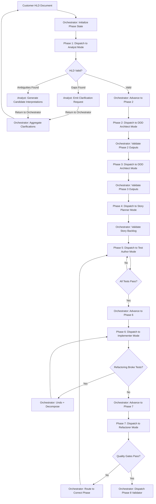
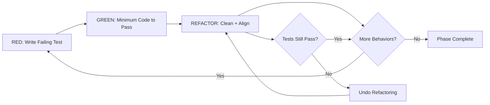
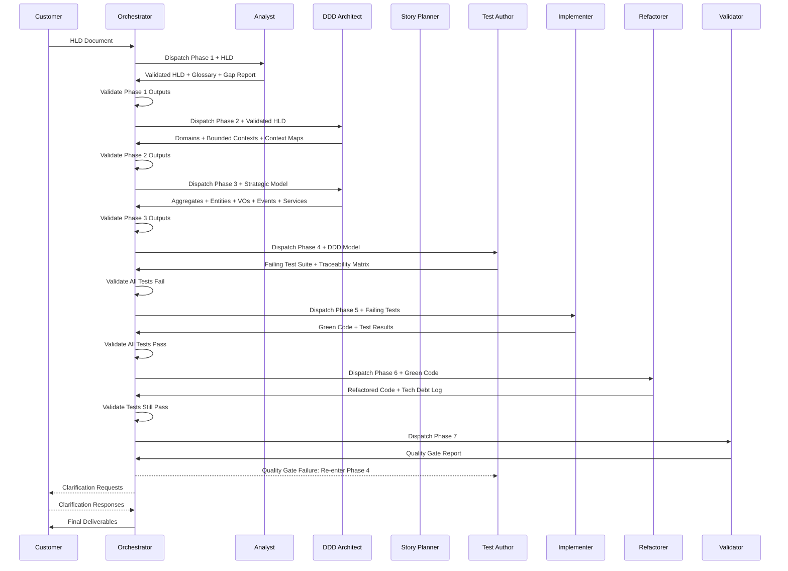

# TDD-DDD Framework Specification — Implementation Plan

## 1. Objective

Create a production-ready, directly executable framework specification that serves as Roo's authoritative rule system for building software products using strict Test-Driven Development and Domain-Driven Design. The specification will be technology-agnostic, structured as a set of files under `.agents/framework/`, and enforced mechanically through 8 custom Roo modes with file restrictions (including an orchestrator mode that coordinates phase transitions and skill handoffs).

## 2. Decisions Made

| Decision | Choice | Rationale |
|----------|--------|-----------|
| Output format | Structured directory `.agents/framework/` with separate files per section | Modularity, independent updates, easier navigation |
| Technology scope | Fully technology-agnostic; stack derived from HLD | Reusable across projects |
| Skill enforcement | 8 custom Roo modes with hard file restrictions (including orchestrator) | Mechanical enforcement of TDD discipline — violations become impossible, not merely discouraged |
| Existing rules relationship | New framework references existing `ROO_EXECUTION_RULES.md` by cross-reference; existing rules updated with a pointer to the framework | Avoids duplication, maintains single source of truth for wrapper-command security |

## 3. File Structure

```
.agents/
├── ROO_EXECUTION_RULES.md          # Existing — add framework cross-reference
├── framework/
│   ├── 00-overview.md              # Framework purpose, document index, glossary
│   ├── 01-hld-input-contract.md    # HLD parsing, validation, gap/ambiguity handling
│   ├── 02-ddd-transformation.md    # DDD decomposition pipeline with traceability
│   ├── 03-tdd-execution-model.md   # Red-green-refactor cycle, test layers, quality gates
│   ├── 04-skill-definitions.md     # 8 skills: responsibilities, permissions, prohibitions
│   ├── 05-phase-definitions.md     # 8 phases with artifacts, sequencing, iteration rules
│   ├── 06-naming-conventions.md    # Enforceable naming rules for all artifact types
│   ├── 07-acceptance-criteria.md   # Acceptance criteria, Definition of Done
│   ├── 08-failure-handling.md      # Recovery, rollback, audit log specification
│   ├── 09-handoff-protocol.md      # Inter-skill structured message format
│   └── 10-script-constraint.md     # bare wrapper command enforcement, manifest reference
├── scripts/
│   ├── manifest.json               # NEW — script inventory with contracts
│   ├── curl.cmd / curl.ps1
│   ├── docker.cmd / docker.ps1
│   ├── dotnet.cmd / dotnet.ps1
│   ├── git.cmd / git.ps1
│   ├── repo.cmd / repo.ps1
│   └── ScriptSecurity.psm1
.roo/
├── rules.md                        # Existing — update to also reference framework
└── modes/
    ├── tdd-ddd-orchestrator.md     # Phase coordinator, handoff dispatcher, audit log
    ├── tdd-ddd-analyst.md                   # HLD parsing, domain discovery, glossary
    ├── tdd-ddd-architect.md                # Aggregate design, context maps, contracts
    ├── tdd-ddd-test-author.md              # Test writing — may NOT write production code
    ├── tdd-ddd-implementer.md              # Production code — may NOT write tests
    ├── tdd-ddd-refactorer.md               # Post-green refactoring only
    └── tdd-ddd-validator.md                # Test execution, quality gates, reports
```

## 4. Custom Roo Mode Definitions

Each mode maps to a framework skill and enforces file restrictions:

### 4.0 TDD-DDD Orchestrator Mode

| Property | Value |
|----------|-------|
| Slug | `tdd-ddd-orchestrator` |
| Name | 🎯 TDD-DDD Orchestrator |
| Role | Phase state machine coordinator, skill dispatcher, precondition validator, audit log maintainer |
| Writable files | `*.md`, `*.json` under `docs/`, `.agents/framework/`, audit logs, phase state files |
| Read-only | All source code and test files |
| Prohibited actions | Writing any source code or test code directly |

**Orchestrator Responsibilities:**

1. **Phase State Management**: Track the current phase (1–8), enforce sequential progression, and block phase advancement until all exit criteria are met
2. **Skill Dispatching**: Determine which skill mode is needed next based on the current phase and sub-step, then initiate the mode switch with a structured handoff message
3. **Precondition Validation**: Before dispatching to any skill mode, verify that all input artifacts exist and meet the expected contract
4. **Handoff Coordination**: Receive completion signals from skill modes, validate output artifacts, and route to the next skill or back for rework
5. **Audit Log Maintenance**: Append every phase transition, skill dispatch, handoff acceptance/rejection, quality gate result, and deviation to the immutable audit log
6. **Failure Routing**: When a skill mode reports a failure (e.g., test breakage, quality gate failure), determine the correct recovery path per `08-failure-handling.md` and dispatch accordingly
7. **Progress Reporting**: Maintain a living status dashboard showing current phase, active skill, completed artifacts, pending work, and any blockers
8. **Clarification Aggregation**: Collect clarification requests from skill modes and present them to the customer as a consolidated batch rather than piecemeal

**Orchestrator State File**: `.agents/state/phase-state.json`
```json
{
  "currentPhase": 1,
  "currentSkill": "tdd-ddd-analyst",
  "phaseHistory": [],
  "pendingClarifications": [],
  "auditLogPath": ".agents/state/audit.jsonl",
  "artifactRegistry": {}
}
```

### 4.1 Analyst Mode

| Property | Value |
|----------|-------|
| Slug | `tdd-ddd-analyst` |
| Name | 🔍 TDD-DDD Analyst |
| Role | HLD parsing, domain discovery, ubiquitous language glossary, context mapping |
| Writable files | `*.md`, `*.json` under `docs/`, `.agents/framework/`, project `glossary/` |
| Read-only | Everything else |
| Prohibited actions | Writing any source code or test code |

### 4.2 DDD Architect Mode

| Property | Value |
|----------|-------|
| Slug | `tdd-ddd-architect` |
| Name | 🏛️ TDD-DDD Architect |
| Role | Aggregate design, bounded context interface contracts, infrastructure topology, conflict resolution |
| Writable files | `*.md`, `*.json`, interface/contract definition files, architecture decision records |
| Read-only | Test files, production implementation files |
| Prohibited actions | Writing test bodies or production implementation logic |

### 4.3 Story Planner Mode

| Property | Value |
|----------|-------|
| Slug | `tdd-ddd-story-planner` |
| Name | 📋 TDD-DDD Story Planner |
| Role | Decomposing validated DDD outputs into an ordered, MVP-scoped story backlog |
| Writable files | `docs/stories/*.json`, `docs/stories/*.md`, `docs/**/*.md`, `.agents/state/*.json` |
| Read-only | Source code and test files |
| Prohibited actions | Writing production code or automated tests |

### 4.4 Test Author Mode

| Property | Value |
|----------|-------|
| Slug | `tdd-ddd-test-author` |
| Name | 🧪 TDD-DDD Test Author |
| Role | Writing all test artifacts before implementation, test data builders, traceability matrices |
| Writable files | `*Test*`, `*Spec*`, `*test*`, `*spec*`, test fixture/builder files, `*.md` |
| Read-only | Production source files — may read for interface discovery but NOT modify |
| Prohibited actions | Writing or modifying production code |

### 4.5 Implementer Mode

| Property | Value |
|----------|-------|
| Slug | `tdd-ddd-implementer` |
| Name | 🔨 TDD-DDD Implementer |
| Role | Writing minimum production code to pass existing failing tests |
| Writable files | Production source files — NOT test files |
| Read-only | Test files — may read to understand expectations |
| Prohibited actions | Writing or modifying test files; writing speculative code beyond what failing tests require |

### 4.6 Refactorer Mode

| Property | Value |
|----------|-------|
| Slug | `tdd-ddd-refactorer` |
| Name | ♻️ TDD-DDD Refactorer |
| Role | Post-green refactoring, tech debt logging, DDD alignment review |
| Writable files | Production source files, `*.md` for tech debt logs |
| Read-only | Test files — must not change test expectations during refactoring |
| Prohibited actions | Modifying test assertions or expectations; adding new functionality |

### 4.7 Validator Mode

| Property | Value |
|----------|-------|
| Slug | `tdd-ddd-validator` |
| Name | ✅ TDD-DDD Validator |
| Role | Running test suites, enforcing quality gates, generating reports, issuing pass/fail verdicts |
| Writable files | `*.md`, `*.json`, `*.xml` report files only |
| Read-only | All source and test files |
| Prohibited actions | Modifying any source or test code |

## 5. Document Content Specifications

### 5.1 `00-overview.md`
- Framework purpose and authority statement
- Document index with descriptions
- Glossary of framework-specific terms
- Relationship to `ROO_EXECUTION_RULES.md`
- Version and change log section

### 5.2 `01-hld-input-contract.md`
- HLD as sole mandatory input artifact
- Required HLD sections: business goals, user personas, feature narratives, non-functional requirements, integration points, deployment constraints
- Parsing and normalization steps with validation checklist
- Missing section handling: halt + structured clarification request with enumerated gaps
- Ambiguous section handling: generate >=2 candidate interpretations ranked by likelihood with explicit assumptions, block progress on affected domain until resolved
- HLD requirement numbering scheme for traceability

### 5.3 `02-ddd-transformation.md`
- Deterministic sequence from validated HLD to full DDD model
- Step-by-step pipeline:
  1. Extract ubiquitous language verbatim from HLD
  2. Identify and name domains
  3. Delineate bounded contexts
  4. Create context maps with relationship types: shared kernel, customer-supplier, anticorruption layer, conformist, open host service, published language
  5. Define aggregates with invariant specs and consistency boundaries
  6. Define entities with identity rules and lifecycle states
  7. Define value objects with immutability contracts and equality semantics
  8. Define domain events with schemas and causality chains
  9. Define repository interfaces with query contracts and persistence ignorance
  10. Define domain services for cross-aggregate logic
  11. Define application services and workflows for use case orchestration
- Mandatory traceability tag format: `[HLD-REQ-NNN]` on every artifact
- Conflict resolution protocol: document conflict, propose boundary adjustment with ACL, log deviation with rationale and tech debt ticket

### 5.4 `03-tdd-execution-model.md`
- Red-green-refactor as the ONLY permitted development cadence
- RED phase: failing test first, encoding expected behavior from DDD model, traceable to HLD requirement
- GREEN phase: minimum code to pass — no speculative implementation
- REFACTOR phase: mandatory after every green, with checklist:
  - Duplication removal
  - Naming alignment with ubiquitous language
  - Aggregate boundary re-evaluation
  - SOLID principles adherence
- Test layer granularity:
  - Unit tests: entities, value objects, aggregates, domain services
  - Integration tests: repository implementations, ACLs, infrastructure adapters
  - Contract tests: bounded context interfaces, inter-context communication
  - Acceptance tests: application workflows mapped 1:1 to HLD use cases
  - Property-based tests: value objects, stateless domain logic
- Quality gates:
  - No skipped/pending tests without linked blocking-issue ID
  - Code coverage >= configurable threshold (default 90%) on domain/application layers
  - Mutation testing on aggregate invariant tests with >= 85% kill rate
  - All tests pass before artifact marked complete

> ARCHIVAL NOTE: This planning document records the baseline design path that led to the current repository state. Where it conflicts with the authoritative framework under [`.agents/framework/`](.agents/framework/) or [`.roo/rules.md`](.roo/rules.md:1), the authoritative framework wins.

### 5.5 `04-skill-definitions.md`
- Per-skill specification:
  - Responsibilities list
  - Permitted actions list
  - Prohibited actions list
  - Input artifacts expected
  - Output artifacts produced
  - Preconditions for activation
- Skills: TDD-DDD Orchestrator, Analyst, DDD Architect, Story Planner, Test Author, Implementer, Refactorer, Validator
- Cross-reference to Roo mode slugs
- Orchestrator as the mandatory entry point and coordinator — no skill mode may be entered directly except via orchestrator dispatch
- Escalation rules when a skill encounters work outside its scope

### 5.6 `05-phase-definitions.md`
- 8 mandatory phases in strict sequence:
  1. HLD Intake and Validation → validated HLD + gap report
  2. Strategic Domain Modeling → domains, bounded contexts, context maps, glossary
  3. Tactical Domain Modeling → aggregates, entities, VOs, events, repos, services with specs
  4. Story Decomposition → ordered MVP-scoped backlog, story files, and MVP scope record
  5. Test Specification → complete failing test suite at all layers with traceability
  6. Implementation → production code passing all tests, no speculative additions
  7. Refactoring → cleaned, DDD-aligned, SOLID-compliant code + updated docs
  8. Validation and Delivery → quality gate report, traceability matrix, ADRs, tech debt register, deployable artifacts
- Named output artifacts per phase with specified formats
- Phase skip/reorder prohibition
- Intra-phase iteration via red-green-refactor only

### 5.7 `06-naming-conventions.md`
- Bounded contexts: PascalCase nouns from ubiquitous language
- Aggregates: PascalCase nouns, no redundant suffix
- Entities and value objects: PascalCase nouns
- Domain events: past-tense verb phrases in PascalCase
- Repositories: `I` prefix + aggregate name + `Repository`
- Domain services: PascalCase verb-noun phrases
- Application services: PascalCase use-case name + `ApplicationService`
- Test files: mirror production path with `Test` or `Spec` suffix
- Test methods: `should_ExpectedBehavior_When_Condition`
- File organization conventions by bounded context

### 5.8 `07-acceptance-criteria.md`
- Per-artifact acceptance criteria:
  - DDD artifact: >= 1 traceable `[HLD-REQ-NNN]` tag
  - Test: asserts single logical behavior
  - Aggregate: all stated invariants tested
  - BC interface: has contract test
  - Application workflow: has E2E acceptance test
- Definition of Done for entire product:
  - All 8 phases completed in order
  - All quality gates passed
  - Traceability matrix complete — no orphaned requirements or tests
  - Zero failing tests
  - Coverage and mutation thresholds met
  - Ubiquitous language glossary reviewed and finalized
  - ADRs documenting every DDD-to-technical compromise
  - Tech debt register with prioritized remediation plan

### 5.9 `08-failure-handling.md`
- Insufficient domain knowledge → trace to HLD, emit clarification request, halt
- Green breaks prior tests → revert to last stable state, re-enter RED
- Refactoring breaks tests → undo refactoring, log as risky, decompose into smaller steps
- Quality gate failure → enumerate failing criteria, re-enter appropriate phase
- Timestamped immutable audit log specification:
  - Phase transitions
  - Skill handoffs
  - Test results
  - Quality gate evaluations
  - Process deviations
- Audit log format: JSON-lines with ISO 8601 timestamps

### 5.10 `09-handoff-protocol.md`
- Structured handoff message format:
  - Originating skill/mode
  - Target skill/mode
  - Artifact references with file paths
  - Traceability tags
  - Precondition assertions
  - Status summary
- Handoff validation: target skill must verify preconditions before accepting
- Rejection protocol: if preconditions not met, return to originating skill with deficiency list

### 5.11 `10-script-constraint.md`
- Inviolable rule: use only bare approved wrapper commands (`dotnet.cmd`, `docker.cmd`, `git.cmd`, `curl.cmd`, `repo.cmd`)
- Fatal error on any attempt to use/create/reference non-approved commands or wrapper repo paths as invocation targets
- Violation report format
- Reference to `manifest.json` requirements
- Manifest schema: script name, purpose, phase association, input contract, output contract

## 6. Workflow Diagram



## 7. TDD Red-Green-Refactor Cycle Detail



## 8. Handoff Flow Between Modes



## 9. Implementation Order

The files should be created in this sequence:

1. `.agents/scripts/manifest.json` — Script inventory for existing wrappers
2. `.agents/framework/00-overview.md` — Must exist first as the index
3. `.agents/framework/01-hld-input-contract.md`
4. `.agents/framework/02-ddd-transformation.md`
5. `.agents/framework/03-tdd-execution-model.md`
6. `.agents/framework/04-skill-definitions.md`
7. `.agents/framework/05-phase-definitions.md`
8. `.agents/framework/06-naming-conventions.md`
9. `.agents/framework/07-acceptance-criteria.md`
10. `.agents/framework/08-failure-handling.md`
11. `.agents/framework/09-handoff-protocol.md`
12. `.agents/framework/10-script-constraint.md`
13. `.roo/modes/tdd-ddd-orchestrator.md` — Orchestrator mode (entry point)
14. `.roo/modes/tdd-ddd-analyst.md`
15. `.roo/modes/tdd-ddd-architect.md`
16. `.roo/modes/tdd-ddd-test-author.md`
17. `.roo/modes/tdd-ddd-implementer.md`
18. `.roo/modes/tdd-ddd-refactorer.md`
19. `.roo/modes/tdd-ddd-validator.md`
20. Update `.agents/ROO_EXECUTION_RULES.md` — Add framework cross-reference
21. Update `.roo/rules.md` — Add framework cross-reference

## 10. Key Design Principles

- **Deterministic**: Every step has a single defined path; no discretionary shortcuts
- **Traceable**: Every artifact chains back to an HLD requirement via `[HLD-REQ-NNN]` tags
- **Mechanically enforced**: Custom Roo modes prevent role violations through file restrictions
- **Technology-agnostic**: Stack decisions deferred to HLD; framework speaks in DDD/TDD abstractions
- **Fail-safe**: Every failure mode has an explicit recovery procedure
- **Auditable**: Immutable timestamped log of every decision, transition, and deviation
